# Content Editor SPE Reports and Tools

By SiteTroopers (Prasanth N., Pablo B., Byron C.)

## Summary

**Category:** Best use of SPE to help Content authors and Marketers

This module includes reports and tools developed in SPE to help Content Authors and Marketers obtain quick and important information about the project they are working on. The following is a list of the tools and reports included in this package:

- Items Created by Given User Before or After Certain Date
- Items Updated by Given User Before or After Certain Date
- Items by Workflow State
- Items with Given Goal
- Deep Compare Items Between Master and Web
- Never Publish Pages Report
- Disabled Analytics Pages Report
- My Latest Modified Publishable Items
- Publish My Latest Modified Publishable Items
- Edit All Fields

## Pre-requisites

The only pre-requisite for these tools and reports to work is to have the Full Sitecore PowerShell Extensions 5.0 installed in your Sitecore instance.

## Installation

- Go to Development Tools -> Installation Wizard.
- Upload the .zip package.
- Click on Install and wait for the installation process to finish.
- Make sure you restart the Sitecore client after installation is finished.

## Configuration

No additional configuration is needed for these tools and reports to work.

## Usage

After installing the package, go to Desktop mode and verify the reports were created under Reporting Tools -> PowerShell Reports -> Content Editor SPE Tools and Reports

The following is a description on how to use each report included in the package.

### Items Created by Given User Before or After Certain Date

This report shows all the items that have been created before or after the specified date/time.

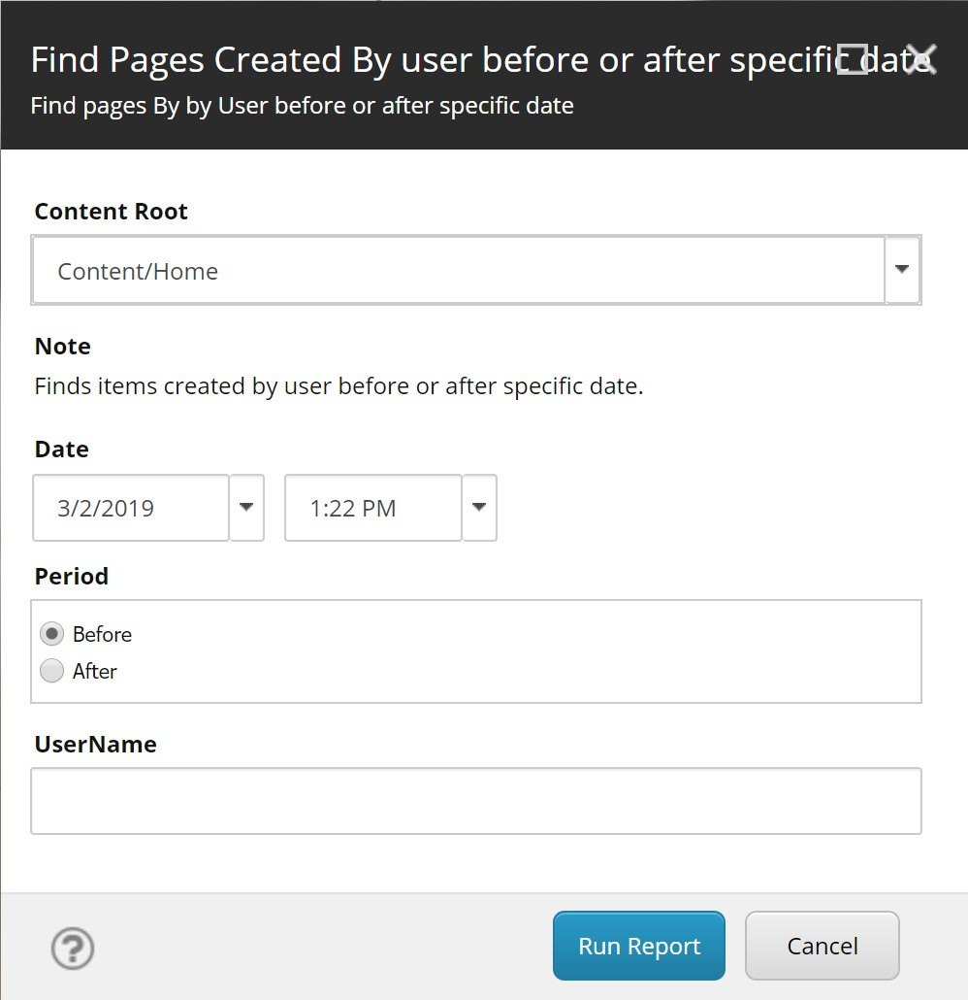

1. Select the Content Root to start searching for items. 
2. Select a date and time (default is current date and time).
3. Select Period, if you want a report for items created before or after the specified date and time
4. In UserName enter the full domain and username (domain\username)
5. Click on Run Report to get the report.

### Items Updated by Given User Before or After Certain Date

This report shows all the items that have been updated before or after the specified date/time.

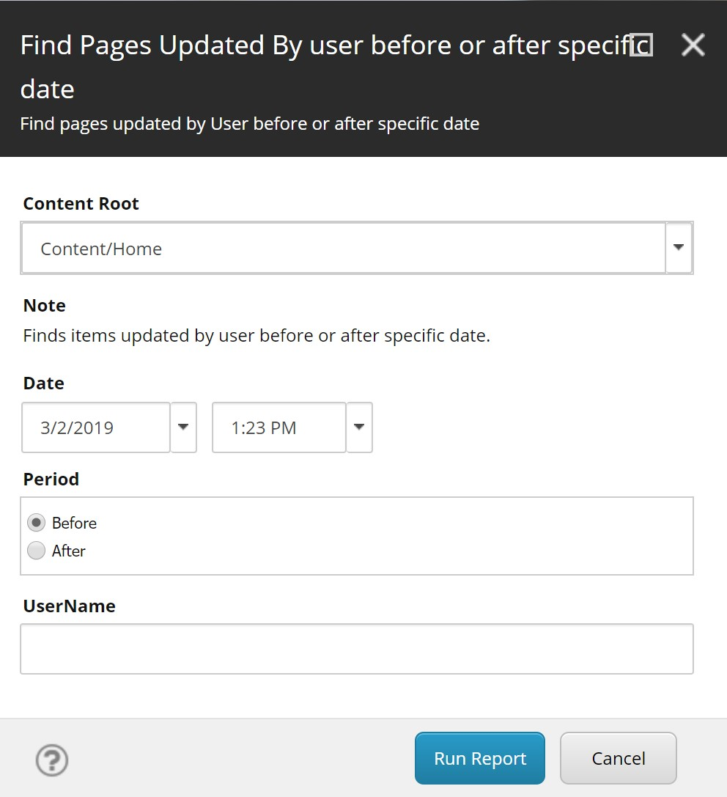

1. Select the Content Root to start searching for items. 
2. Select a date and time (default is current date and time).
3. Select Period, if you want a report for items updated before or after the specified date and time
4. In UserName enter the full domain and username (domain\username)
5. Click on Run Report to get the report.

### Items by Workflow State

This report shows all items that are on the specified Workflow State.

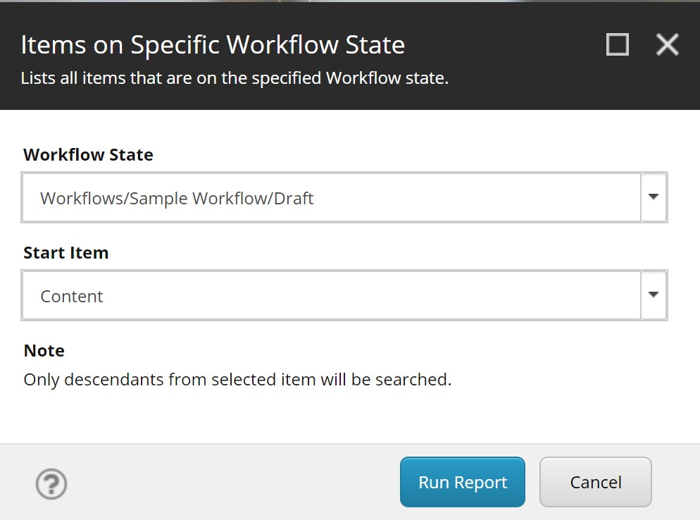

1. Select a State inside any workflow. It will validate if you select a valid Workflow State
2. Select the starting item to search. It will check only the descendants of the item, not the item itself.
3. Run the Report

### Items with Given Goal

This report shows all items that have assigned the specified Goal

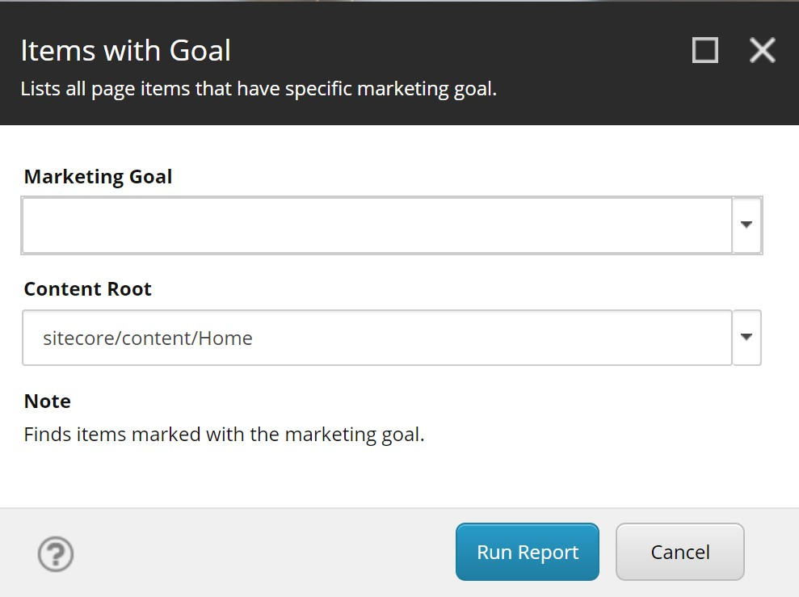

1. Select a Marketing Goal
2. Select the starting item to search. It will check only the descendants of the item, not the item itself.
3. Run the Report

### Deep Compare Items Between Master and Web

This report shows all fields in items that are different between the items in the master database and the web database

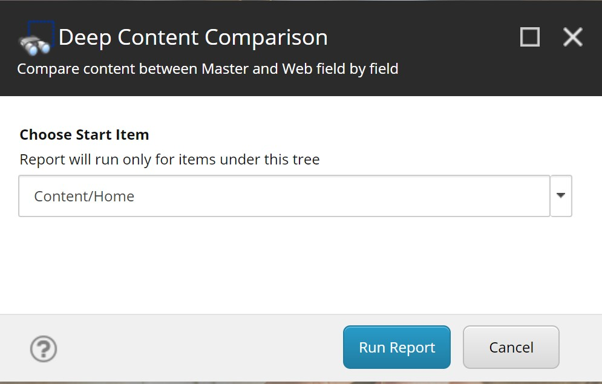

Just choose the Start Item to start the comparison.

### Never Publish Pages Report

This report shows all the items that have the *Never Publish* switch selected.

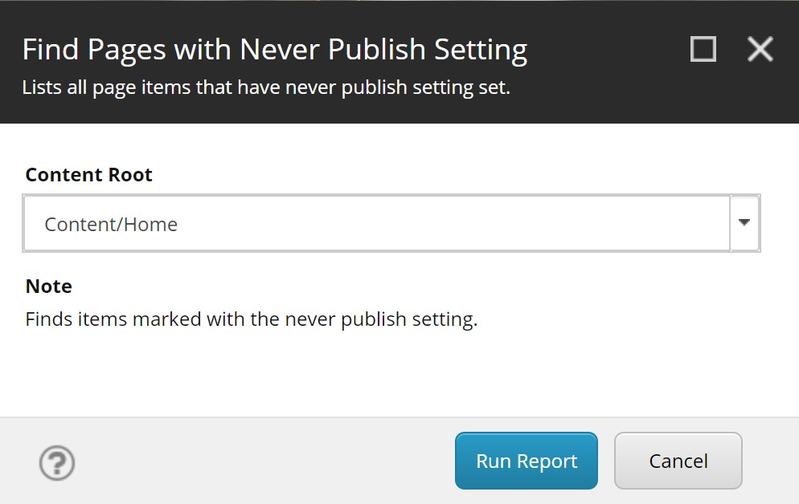

Just choose the Content Root and Run the Report.

### Disabled Analytics Pages Report

This report shows all the items that have the *Disable Analytics* switch selected.

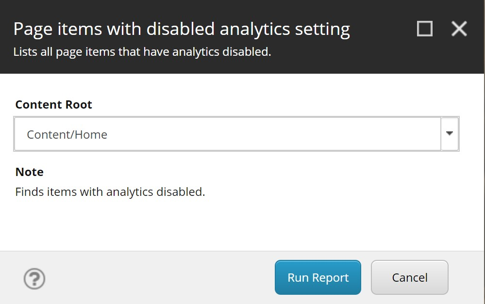

Just choose the Content Root and Run the Report.

### My Latest Modified Publishable Items

This report shows the items modified by the current user before or after the selected date/time.

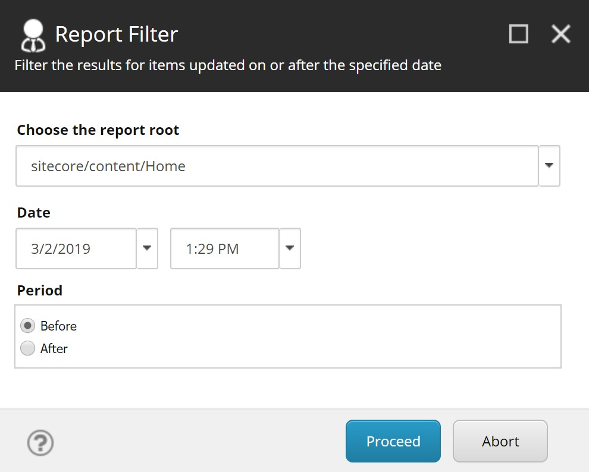

1. Choose the Report Root to search for items
2. Choose a date and/or time
3. Choose a Period, Before for items modified before the selected date/time, After for items modified after the selected date/time
4. Run the Report

### Publish My Latest Modified Publishable Items

**WARNING** This is *NOT* a report. First use the *My Latest Modified Publishable Items* to verify the items that are going to be published.

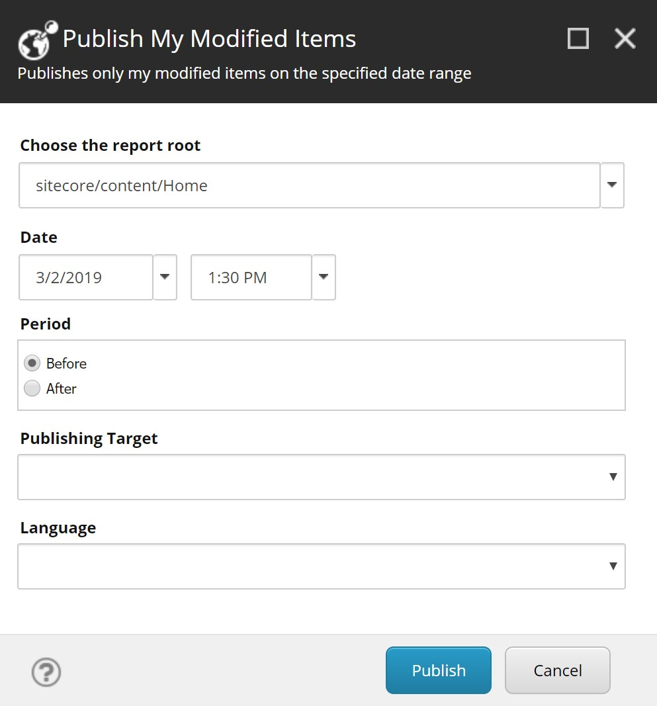

1. Choose the Report Root to search for items
2. Choose a date and/or time
3. Choose a Period, Before for items modified before the selected date/time, After for items modified after the selected date/time
4. Run the Publish. You will get a report of the pages published.

### Edit All Fields

This tool allows editors in Experience Editor to easily find all editable fields and edit them on the fly.

When selecting any editable field in Experience Editor, in the pop-up ribbon you will find this new button:

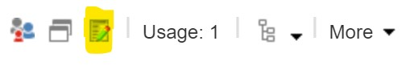

When you click on that button, you will get a list of all the editable fields in the page:

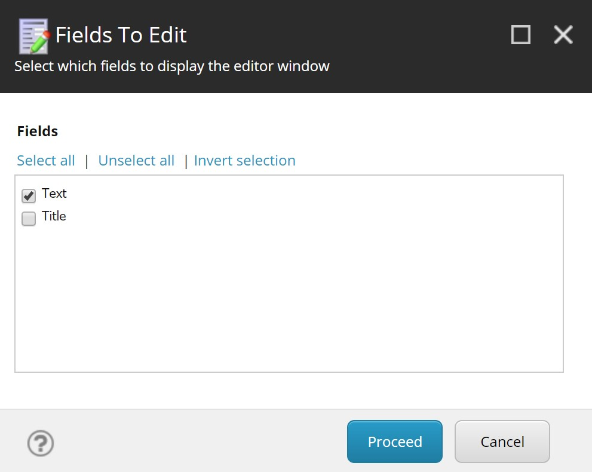

Select the fields that you want to edit and click on Proceed. You will get a window with each field that you selected. Edit the field contents and click OK when done.

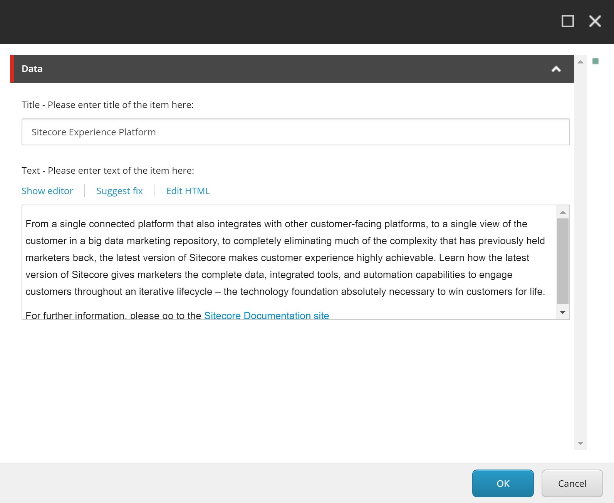